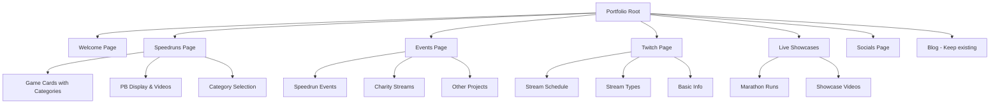

# 🏗️ DrakeLeLionBlanc Portfolio Transformation Plan

## Overview
Transform the existing Astro blog template into a comprehensive speedrunning and streaming portfolio showcasing your achievements, events, and social presence.

## 🎯 Project Structure



## 📁 File Structure Changes

### New Content Collections
- `src/content/speedruns/` - Individual game data
- `src/content/events/` - Past events and streams
- `src/content/showcases/` - Marathon runs and live showcases

### New Pages
- `src/pages/speedruns.astro` - Main speedruns gallery
- `src/pages/events.astro` - Events timeline
- `src/pages/twitch.astro` - Streaming information
- `src/pages/showcases.astro` - Live showcases
- `src/pages/socials.astro` - Social media links
- `src/pages/welcome.astro` - Welcome/about page

### New Components
- `src/components/GameCard.astro` - Individual game display
- `src/components/CategorySelector.astro` - Category switching
- `src/components/EventCard.astro` - Event display
- `src/components/SocialLink.astro` - Social media links
- `src/components/VideoEmbed.astro` - Video player component

## 🎮 Speedruns Page Features

### Game Card Structure
```typescript
interface Speedrun {
  game: string;
  image: string;
  categories: {
    name: string;
    personalBest: string;
    rank: number;
    videoUrl: string;
    platform: string;
    date: string;
  }[];
}
```

### Interactive Features
- **Category Selection**: Clear visual indication of selected category
- **PB Display**: Time, rank, and date prominently displayed
- **Video Integration**: Embedded videos or links to runs
- **Platform Icons**: PC, Console indicators
- **Ranking Badges**: Visual rank indicators

### Example Games (from your data):
- **Lunistice**: Any% Glitchless - 27m 18s 680ms (26th place)
- **Dishonored**: Any% - 39m 19s 180ms (199th place)
- **Crow Country**: Any% Restricted - 17m 16s (12th place)
- **Haiku, the Robot**: Any% - 25m 02s (28th place)

## 📅 Events Page Structure

### Event Types
1. **Speedrun Events**: Marathon participation, races
2. **Charity Streams**: Fundraising events
3. **Community Projects**: Collaborative streams
4. **Special Showcases**: Game launches, challenges

### Event Card Features
- Event title and description
- Date and duration
- Playlist/video links
- Participant information
- Fundraising totals (for charity events)

## 📺 Twitch Page Content

### Basic Information Section
- Stream schedule
- Follower count
- Recent highlights
- Stream setup/equipment

### Stream Types Section
- **Speedrun Shows**: Regular PB attempts
- **Multiplayer Sessions**: Community games
- **Variety Content**: Game exploration
- **Educational Streams**: Speedrun tutorials

### Future Advertising Space
- Upcoming events
- Special stream announcements
- Community challenges

## 🏆 Live Showcases Page

### Marathon Run Features
- Event name and date
- Game and category
- Final time and placement
- Video highlights
- Commentary/notes about the run

## 🌐 Socials Page Layout

### Platform Integration
- **Twitch**: Live status, recent clips
- **Speedrun.com**: Profile link, recent PBs
- **GitHub**: Development projects
- **Bluesky**: Recent posts
- **Discord**: Community server
- **TikTok**: Short-form content
- **YouTube**: Long-form videos

## 🎨 Design & Styling

### Material Design 3 Implementation
- **Color Scheme**: Gaming-focused palette with speedrun aesthetics
- **Typography**: Clean, readable fonts for times and data
- **Cards**: Elevated surfaces for game/event cards
- **Navigation**: Bottom navigation for mobile, sidebar for desktop
- **Icons**: @mdi/js for consistent iconography

### Responsive Design
- Mobile-first approach
- Card-based layouts
- Collapsible navigation
- Touch-friendly interactions

## 🔧 Technical Implementation

### Content Collections Schema
```typescript
// Speedruns Collection
const speedruns = defineCollection({
  schema: z.object({
    game: z.string(),
    image: z.string(),
    categories: z.array(z.object({
      name: z.string(),
      personalBest: z.string(),
      rank: z.number(),
      videoUrl: z.string().optional(),
      platform: z.string(),
      date: z.date(),
    })),
  }),
});

// Events Collection
const events = defineCollection({
  schema: z.object({
    title: z.string(),
    type: z.enum(['speedrun', 'charity', 'community', 'showcase']),
    date: z.date(),
    description: z.string(),
    playlistUrl: z.string().optional(),
    participants: z.array(z.string()).optional(),
  }),
});
```

### Navigation Updates
- Update header navigation to include all new pages
- Add active state indicators
- Mobile hamburger menu for smaller screens

### Performance Optimizations
- Image optimization for game covers
- Lazy loading for video embeds
- Static generation for all pages

## 📱 Mobile Experience

### Key Features
- Swipeable game cards
- Collapsible category selectors
- Touch-friendly video controls
- Optimized social media integration

## 🚀 Implementation Phases

### Phase 1: Foundation
1. Update site constants and branding
2. Create new content collections
3. Update navigation structure

### Phase 2: Core Pages
1. Speedruns page with game cards
2. Events timeline page
3. Basic Twitch information page

### Phase 3: Enhanced Features
1. Interactive category selection
2. Video integration
3. Social media integration

### Phase 4: Polish
1. Mobile optimization
2. Performance improvements
3. SEO optimization

## 📊 Content Management

### Easy Updates
- Markdown files for each game/event
- Simple frontmatter for metadata
- Image assets in organized folders
- Automated builds on content changes

## 🎯 Success Metrics

### User Experience
- Clear navigation between sections
- Fast loading times
- Mobile-responsive design
- Accessible content structure

### Content Showcase
- Prominent display of personal bests
- Easy category switching
- Engaging event timeline
- Professional social media presence

### Technical Excellence
- TypeScript implementation
- Material Design 3 compliance
- SEO optimization
- Performance best practices

---

**Next Steps**: Switch to Code mode to begin implementation following this comprehensive plan.